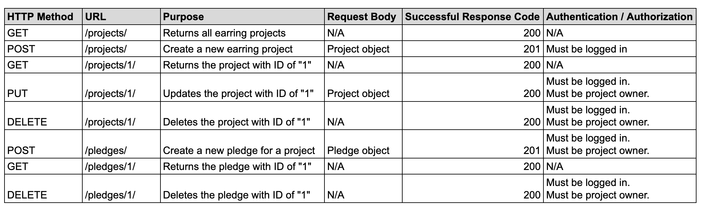
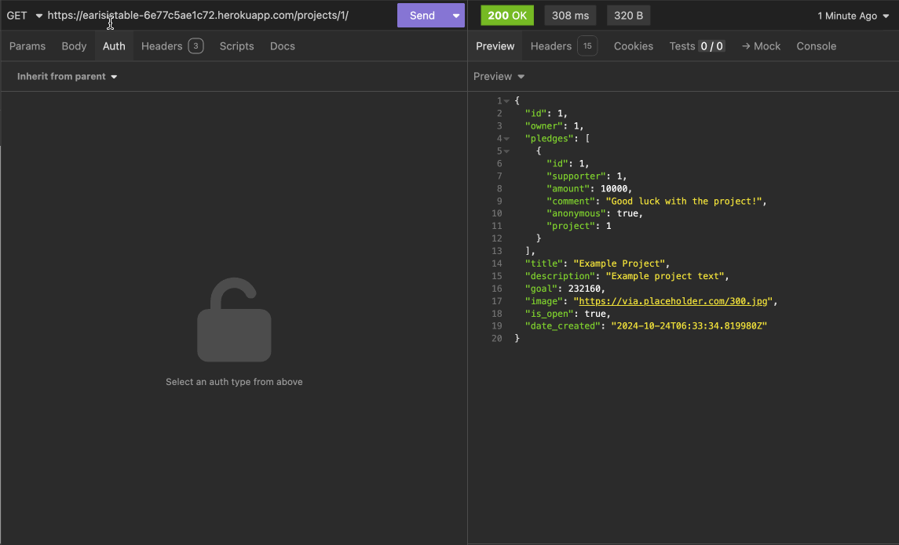
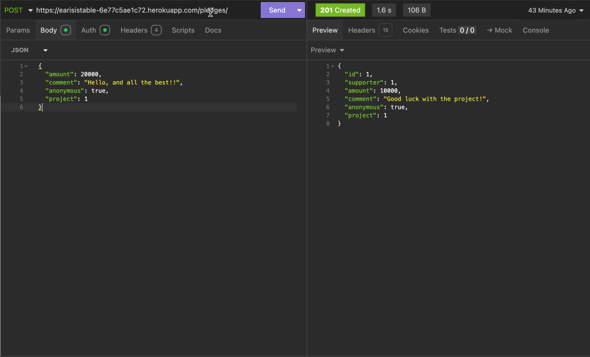
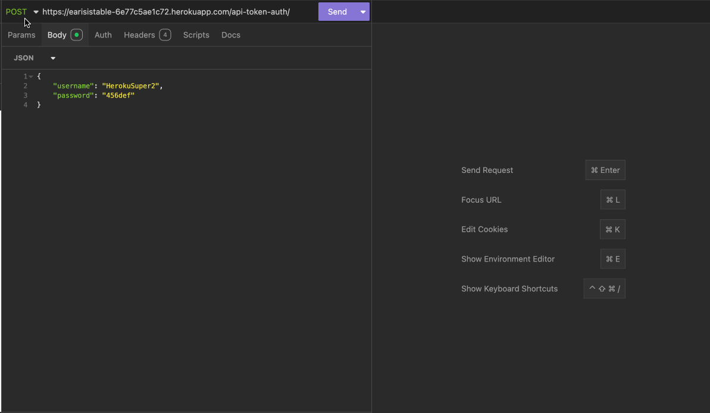
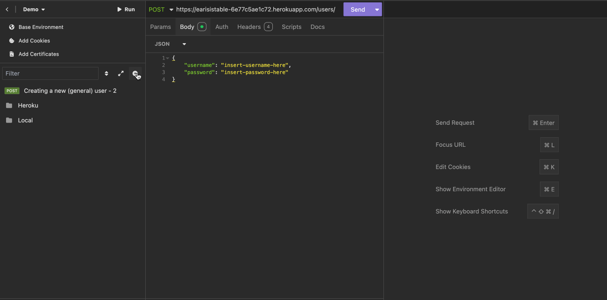
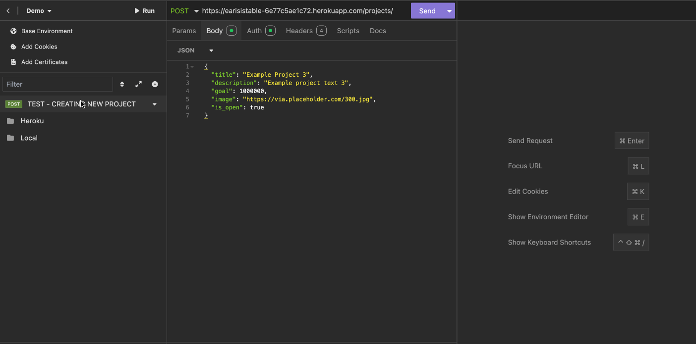

# Crowdfunding Back End

## Planning:
### Concept/Name
**Ear-Resistible** - This is a crowdfunding platform where users can support and fund unique earring projects. Creators can showcase their earring designs or DIY kits, and backers can pledge money to help bring these projects to life.

### Intended Audience/User Stories
- Backers/Supporters: Users who want to financially support unique earring designs and DIY kits.
- Creators: Users who create and propose earring projects to be crowdfunded.

### Front End Pages/Functionality
**Home Page**
- Display featured earring projects and their funding progress.
- Include search and filter options for users to find projects by style or funding status.
- Show recently launched or popular projects.

**Project Page**
- Provide details about the earring project, including images, descriptions, and funding goals.
- Display funding progress and time remaining.
- Allow users to pledge and choose from reward tiers.

**Creator Dashboard**
- Enable creators to set up and manage their earring projects, including adding descriptions, images, and reward tiers.
- Show funding progress and allow creators to update backers.

**Backer Dashboard**
- Let backers track the projects they’ve supported and view reward delivery status.

### User Stories
- _“As a user, I want to browse through various earring projects, so I can find and support designs that align with my style.”_
- _“As a user, I want to view detailed descriptions, images, and videos of each earring project, so I can make an informed decision before pledging.”_
- _“As a user, I want to see the funding goal and progress of each project, so I know how close it is to being fully funded.”_
- _“As a user, I want to pledge different amounts with corresponding reward tiers, so I can choose how much I want to contribute.”_
- _“As a user, I want to track the status of projects I’ve backed, so I know when to expect my rewards or completed earrings.”_
- _“As a creator, I want to set up a project page with images, descriptions, and a funding goal, so I can showcase my earring design ideas.”_

### API Spec


### DB Schema


-------------------------------------------------------------------------------------------------------------------------------------

## Project Requirements
Your crowdfunding project must:

- [ ] Be separated into two distinct projects: an API built using the Django Rest Framework and a website built using React. *(ONGOING)*
- [X] Have a cool name, bonus points if it includes a pun and/or missing vowels. See https://namelix.com/ for inspiration. <sup><sup>(Bonus Points are meaningless)</sup></sup>
- [X] Have a clear target audience.
- [X] Have user accounts. A user should have at least the following attributes:
  - [X] Username
  - [X] Email address
  - [X] Password
- [X] Ability to create a “project” to be crowdfunded which will include at least the following attributes:
  - [X] Title
  - [X] Owner (a user)
  - [X] Description
  - [X] Image
  - [X] Target amount to fundraise
  - [X] Whether it is currently open to accepting new supporters or not
  - [X] When the project was created
- [X] Ability to “pledge” to a project. A pledge should include at least the following attributes:
  - [X] An amount
  - [X] The project the pledge is for
  - [X] The supporter/user (i.e. who created the pledge)
  - [X] Whether the pledge is anonymous or not
  - [X] A comment to go along with the pledge
- [X] Implement suitable update/delete functionality, e.g. should a project owner be allowed to update a project description?
  <!-- Create a general user with an API token - SEE IMPORTANT NOTES -->
- [X] Implement suitable permissions, e.g. who is allowed to delete a pledge?
  <!-- Create a general user with an API token - SEE IMPORTANT NOTES -->
<!-- Supporter can delete their pledge to a project, when they're logged in -->
<!-- Project owner can modify / delete their project, when they're logged in AND if they're the owner of the project -->
- [X] Return the relevant status codes for both successful and unsuccessful requests to the API.
- [X] Handle failed requests gracefully (e.g. you should have a custom 404 page rather than the default error page). *(ONGOING - INCLUDE OTHER CUSTOMER PAGES like 405, 500 etc)*
- [X] Use Token Authentication, including an endpoint to obtain a token along with the current user's details.
- [ ] Implement responsive design *(ONGOING)*

## Additional Notes
No additional libraries or frameworks, other than what we use in class, are allowed unless approved by the Lead Mentor.

Note that while this is a crowdfunding website, actual money transactions are out of scope for this project.

Please include the following in your readme doc:
- [X] A link to the deployed project 👉 [Please click here](https://earisistable-6e77c5ae1c72.herokuapp.com/)
- [X] A screenshot of Insomnia, demonstrating a successful GET method for any endpoint (see below).

- [X] A screenshot of Insomnia, demonstrating a successful POST method for any endpoint (see below).

- [X] A screenshot of Insomnia, demonstrating a token being returned (see below).

- [X] Step by step instructions for how to register a new user and create a new project (i.e. endpoints and body data).
####  CREATE NEW USER - How To
1. In Insomnia, create a new `POST` request.
2. In the URL searchbar (next to `POST`), add your Heroku deployed link, followed by `/users/`. For example:
```
https://your-deployed-link/users/
```
3. Select `Body`, and then select `JSON`. This will be used to add the body data for creating a new user.
4. Inside the `JSON` file, copy and paste this body data below. Replace any of the `insert-here` texts with your unique username and password, ensuring they are inside the double-quotation marks:
```
{
    "username": "insert-username-here",
    "password": "insert-password-here"
}
```
5. Select `Send`, and it will now return your recently created user details.
####  CREATE NEW USER - Live Demonstration

####  CREATE NEW PROJECT - Live Demonstration

- [X] Your refined API specification and Database Schema.